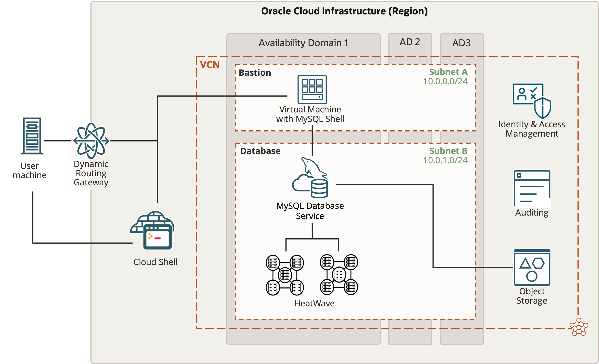

# Introducción

## Acerca de este Workshop

MySQL HeatWave es un servicio de base de datos totalmente gestionado con un acelerador de consultas integrado que permite a las organizaciones ejecutar de manera eficiente el procesamiento de transacciones, el análisis en tiempo real, el almacén de datos y el aprendizaje automático en los datos almacenados dentro de la base de datos MySQL o en el almacén de objetos.

MySQL HeatWave elimina la necesidad de operaciones ETL complejas para mover datos de MySQL para ejecutar análisis o aprendizaje automático. Las aplicaciones MySQL existentes se pueden ejecutar en MySQL HeatWave sin ningún cambio y obtener órdenes de magnitud para mejorar el rendimiento de las consultas con el acelerador de consultas integrado. Con MySQL HeatWave, las organizaciones también pueden ejecutar análisis en cientos de terabytes de datos en el almacén de objetos en una variedad de formatos de archivo como CSV, Parquet, exportar archivos desde Aurora o Redshift, sin necesidad de almacenar datos en MySQL.

En este taller, aprenderá a crear un cluster de MySQL HeatWave, conectarse al cluster mediante MySQL Shell, ejecutar consultas en HeatWave, ejecutar cargas de trabajo de Analytics en Oracle Cloud y crear una aplicación LAMP.

En general, este taller te mostrará lo fácil que es crear y gestionar MySQL HeatWave y cómo MySQL HeatWave te permite tomar decisiones empresariales críticas con conocimiento de causa y en tiempo real.

_Tiempo de laboratorio estimado:_ 1,5 horas

## About Product/Technology

MySQL HeatWave is a massively parallel, high performance, in-memory query accelerator for Oracle MySQL Database Service that accelerates MySQL performance by orders of magnitude for analytics and mixed workloads. It is the only service that enables customers to run OLTP and OLAP workloads directly from their MySQL database without the need of ETL process. MySQL Autopilot uses advanced machine-learning techniques to automates the database lifecycle operations including provisioning, data loading, query processing, and error handling. This minimizes manual administrative work and further improves HeatWave’s usability, performance, and scalability. MySQL HeatWave is also integrated with other Oracle Cloud services such as Data Integration Service and Oracle Analytics Cloud to provide a seamless end-to-end integration.

MySQL Database Service with HeatWave is a fully managed service, optimized for Oracle Cloud Infrastructure. It enables you to:

- Instantly provision MySQL instances and connect to a production ready, pre-configured MySQL database.
- Run OLTP and OLAP workload directly on a single MySQL platform without the need of ETL, and no change in your applications.
- Efficiently run mixed and analytics workloads with best price performance. HeatWave is 6.5X faster than Amazon Redshift at half the cost, 7X faster than Snowflake at one-fifth the cost, and 1400X faster than Amazon Aurora at half the cost.
- Make more informed business decision by getting real-time insights from your operational data.
- Free up time of developers, DBAs, and DevOps to focus on value added tasks that are core to your business.
- Access to dozens of additional Oracle Cloud Services enabling organizations to embrace the shift to the cloud.

_Lab Setup

[//]:    

## Objectives

In this lab, you will be guided through the following steps:

- Create SSH Key on Oracle Cloud Infrastructure Cloud Shell
- Create MySQL Database for HeatWave (DB System) instance 
- Setup Compute instance
- Connect to DB System using MySQL Shell through Compute Instance / Cloud Shell and add sample data (airportdb)
- Add HeatWave cluster to DB System
- Load sample data to HeatWave Cluster
- Run queries in HeatWave and MySQL and see the performance improvement in HeatWave!
- Run MySQL Autopilot to get performance improvement suggestions
- Run queries again in HeatWave and see the improvement!
- Create Lamp test application
- Use Oracle Anayltics Cloud

## Prerequisites

- An Oracle Free Tier, Paid or LiveLabs Cloud Account
- Some Experience with MySQL Shell - [MySQL Site](https://dev.MySQL.com/doc/MySQL-shell/8.0/en/).

You may now **proceed to the next lab**

## Acknowledgements

- **Author** - Perside Foster, MySQL Principal Solution Engineering
- **Contributors** - Mandy Pang, MySQL Principal Product Manager,  Nick Mader, MySQL Global Channel Enablement & Strategy Manager
- **Last Updated By/Date** - Perside Foster, MySQL Solution Engineering, July 2023
